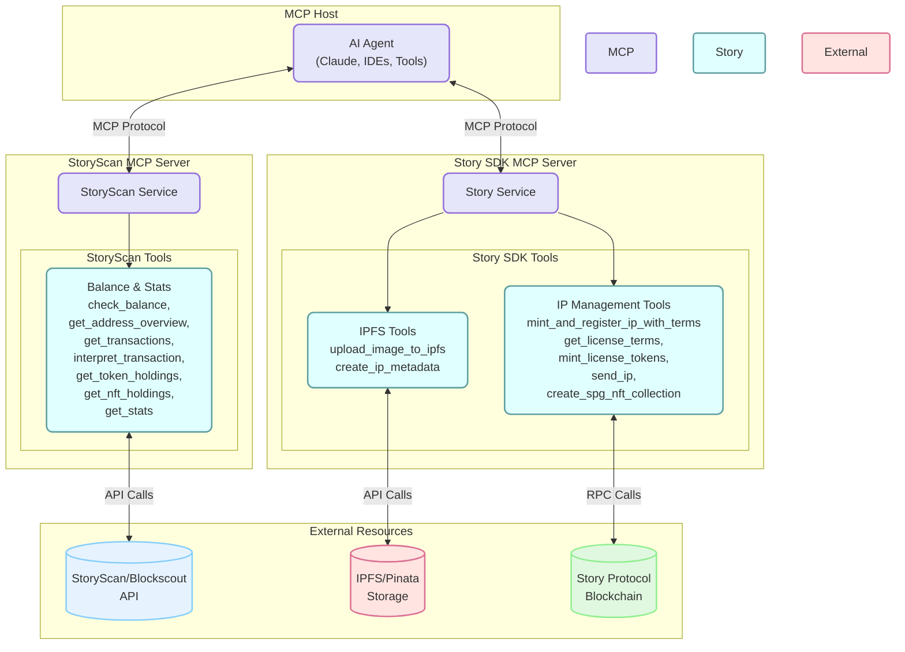

# Story SDK MCP Server

This server provides MCP (Model Context Protocol) tools for interacting with Story's [Python SDK](https://github.com/storyprotocol/python-sdk/).

## Features

- Get license terms
- Mint and register IP Asset with PIL Terms
- Mint license tokens
- Send $IP to a wallet
- Upload image to ipfs via Pinata [External]
- Upload ip and nft metadata via Pinata [External]



## Setup

1. Install dependencies using uv:

```bash
curl -LsSf https://astral.sh/uv/install.sh | sh
uv sync
```

2. Copy `.env.example` to `.env` and fill in your credentials:

```bash
cp .env.example .env
```

Environment variables:

- `WALLET_PRIVATE_KEY`: Your EVM wallet private key
- `RPC_PROVIDER_URL`: Your RPC provider URL. You can use the default one provided.
- `SPG_NFT_CONTRACT`: The address of the SPG NFT contract. You can use the default one provided.
- `PINATA_JWT`: [optional] JWT for uploading images/metadata to pinata. You need this to upload metadata to IPFS when registering an IP. You can get this by creating a new app on [pinata](https://pinata.cloud/)

3. Use inspector to test the server:

```bash
uv run mcp dev server.py
```

## Available Tools

1. `get_license_terms`: Retrieve license terms for a specific ID
2. `mint_license_tokens`: Mint license tokens for a specific IP and license terms
3. `send_ip`: Send IP tokens to a specified address using native token transfer
4. `upload_image_to_ipfs`: Upload an image to IPFS and return the URI
5. `create_ip_metadata`: Create NFT metadata for a specific image URI
6. `mint_and_register_ip_with_terms`: Mint and register an IP with terms

### Example `mint_and_register_ip_with_terms`

You can use the following parameters to test the tool:

1. `commercial_rev_share`: 5
2. `derivatives_allowed`: True
3. `registration_metadata`:

```json
{
  "ip_metadata_uri": "https://azure-wooden-quail-605.mypinata.cloud/ipfs/QmcvC23URQPKSHYB9Xy5AFswy2SKqUYPRg7iYtL5ZqEi7b",
  "ip_metadata_hash": "0xe74a304f3ca32924cef88f7445eca413ff8f80d265417bfc93d6765bb26e4dec",
  "nft_metadata_uri": "https://azure-wooden-quail-605.mypinata.cloud/ipfs/QmegKQTYSeaNgKBncYTPWMJeykHVwDgsiFf493fkXBaWcb",
  "nft_metadata_hash": "0x5c6e29420f759a5cc6497ad1d564db70e2742790f4123225a093209ad55340d7"
}
```

## Usage with MCP

You can use these tools with any MCP-compatible client. The tools are exposed through the MCP protocol and can be accessed using any AI framework of your choosing.
