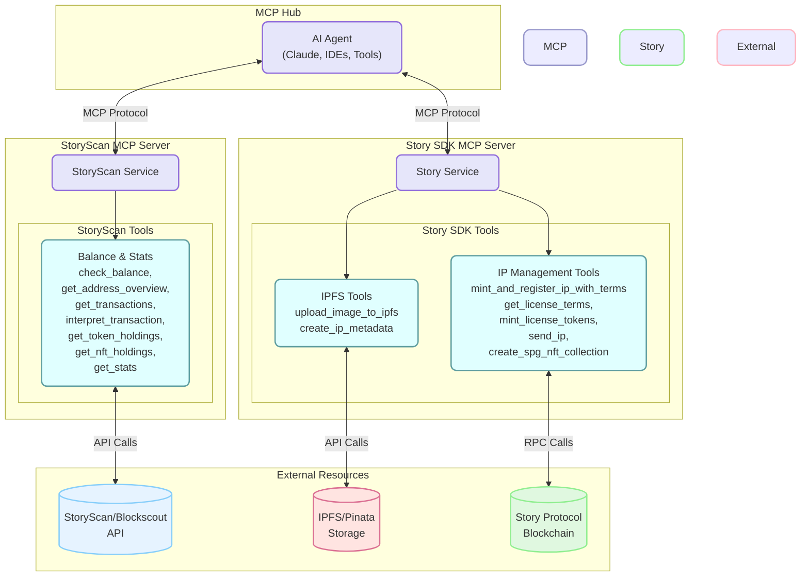

# Story MCP Hub

This repository serves as a central hub for Story Protocol's Model Context Protocol (MCP) servers. It provides a unified environment for running and managing various MCP services that enable AI agents to interact with Story Protocol's ecosystem.

## Project Structure

```
story-mcp-hub/
├── storyscan-mcp/       # MCP server for blockchain data queries via StoryScan 
├── story-sdk-mcp/       # MCP server for Story Protocol SDK interactions
├── utils/               # Shared utilities for MCP servers
├── .venv/               # Python virtual environment
├── pyproject.toml       # Project dependencies and configuration
├── .python-version      # Python version specification
└── README.md            # This file
```



## MCP Servers

### StoryScan MCP Server
Provides tools for querying blockchain data, including address balances, transactions, and blockchain statistics.

**Tools:**
- `check_balance`: Check the balance of an address
- `get_transactions`: Get recent transactions for an address
- `get_stats`: Get current blockchain statistics
- `get_address_overview`: Get a comprehensive overview of an address
- `get_token_holdings`: Get all ERC-20 token holdings for an address
- `get_nft_holdings`: Get all NFT holdings for an address
- `interpret_transaction`: Get a human-readable interpretation of a transaction

### Story SDK MCP Server
Provides tools for interacting with Story Protocol's Python SDK.

**Tools:**
- `get_license_terms`: Retrieve license terms for a specific ID
- `mint_license_tokens`: Mint license tokens for a specific IP and license terms
- `send_ip`: Send IP tokens to a specified address using native token transfer
- `upload_image_to_ipfs`: Upload an image to IPFS and return the URI
- `create_ip_metadata`: Create NFT metadata for a specific image URI
- `mint_and_register_ip_with_terms`: Mint and register an IP with terms

## Setup

### Prerequisites
- Python 3.12+
- UV package manager

### Installation

1. Install UV package manager and install env:

```bash
curl -LsSf https://astral.sh/uv/install.sh | sh
```

2. Clone this repository:

```bash
git clone https://github.com/storyprotocol/story-mcp-hub.git
cd story-mcp-hub
```

3. Install dependencies using UV:

```bash
uv sync
```

4. Set up environment variables for each server:

For StoryScan MCP:
```bash
cd storyscan-mcp
cp .env.example .env
# Edit .env with your StoryScan API endpoint
```

For Story SDK MCP:
```bash
cd story-sdk-mcp
cp .env.example .env
# Edit .env with your wallet private key, RPC provider URL, etc.
```

## Running the Servers

### StoryScan MCP Server Inspector

```bash
cd storyscan-mcp
uv run mcp dev server.py
```

### Story SDK MCP Server

```bash
cd story-sdk-mcp
uv run mcp dev server.py
```

## Development

To add a new MCP server to the hub:

1. Create a new directory for your server
2. Implement the MCP protocol in your server
3. Add any necessary dependencies to the root `pyproject.toml`
4. Update this README with information about your server

## Troubleshooting

If you encounter issues:

1. Verify that environment variables are set correctly for each server
2. Check network connectivity to external APIs (StoryScan, IPFS, etc.)
3. Ensure you're using the correct Python version (3.12+)
4. Check that all dependencies are installed with `uv sync`

## License

[MIT License](LICENSE)
